# WebGenix Dependency Graph & Component Relationships

## Module Dependency Overview

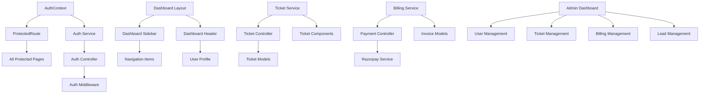

## Frontend Component Dependencies

### Authentication Flow
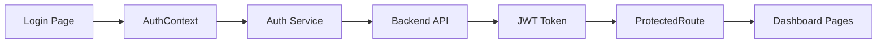

### Dashboard Architecture
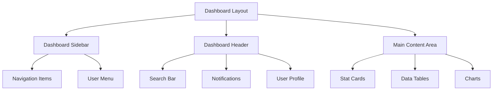

### Ticket System Dependencies
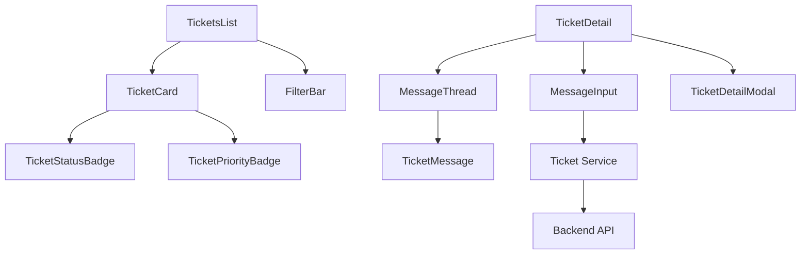

## Backend Module Dependencies

### Core Authentication Flow
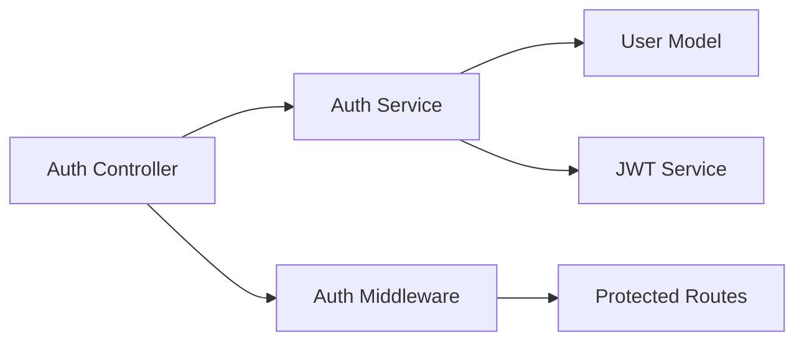

### Ticket System Architecture
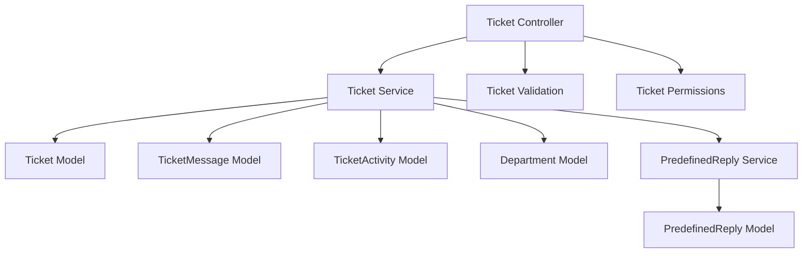

### Billing System Dependencies
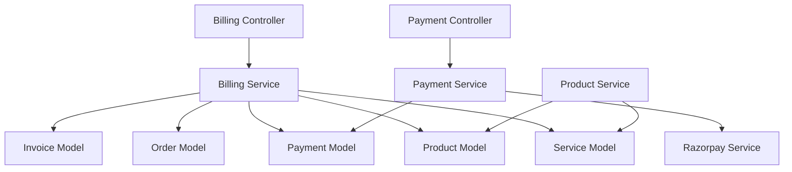

## Cross-Module Relationships

### User-Centric Dependencies
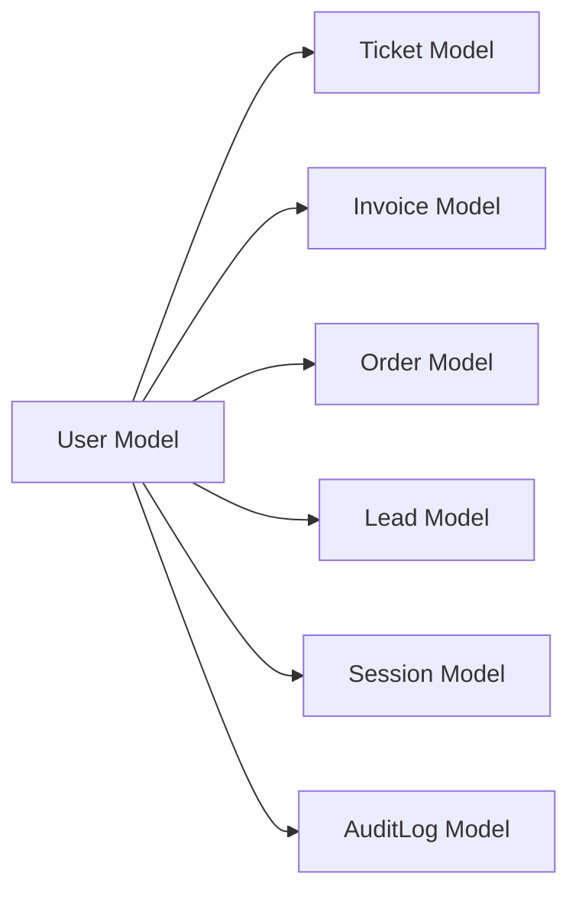

### Admin System Dependencies
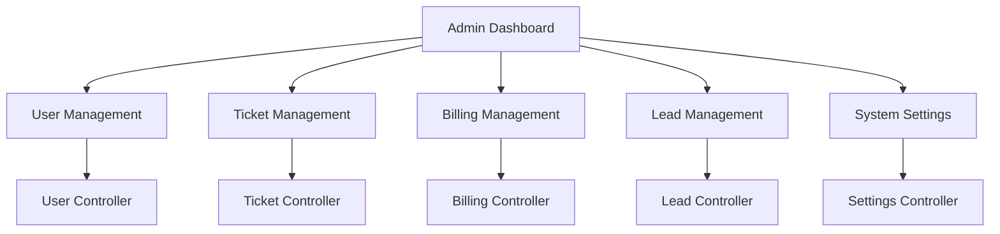

## Data Flow Patterns

### Authentication Data Flow
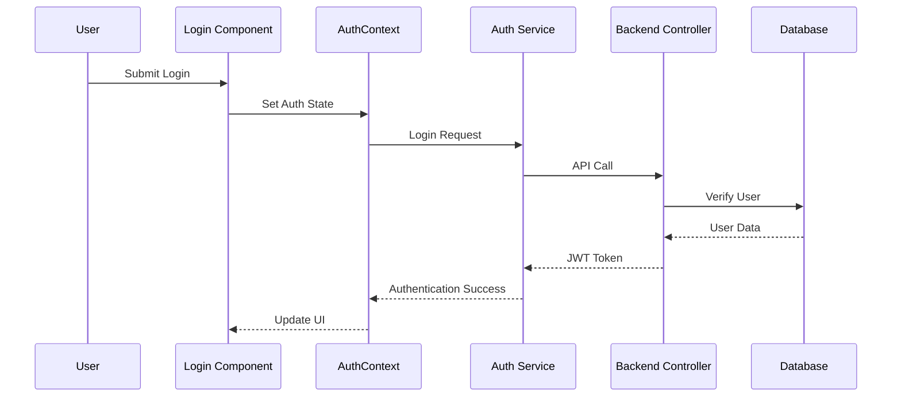

### Ticket Creation Flow
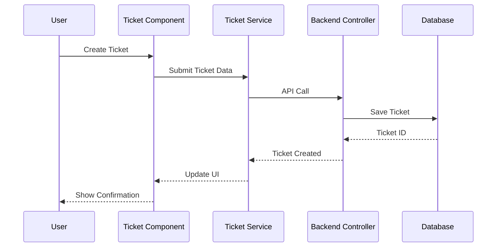

### Payment Processing Flow
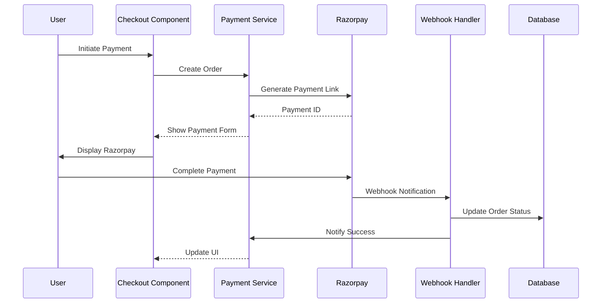

## Component Hierarchy

### Frontend Component Tree
```
App.jsx
├── Navbar.jsx
├── Routes
│   ├── Public Routes
│   │   ├── Home.jsx
│   │   ├── Login.jsx
│   │   ├── Signup.jsx
│   │   └── Knowledgebase.jsx
│   └── Protected Routes (ProtectedRoute.jsx)
│       ├── Dashboard.jsx
│       │   ├── DashboardLayout.jsx
│       │   │   ├── DashboardSidebar.jsx
│       │   │   ├── DashboardHeader.jsx
│       │   │   └── Main Content
│       │   │       ├── StatCard.jsx
│       │   │       ├── DataTable.jsx
│       │   │       └── FilterBar.jsx
│       │   └── Role-Specific Dashboards
│       │       ├── AdminDashboard.jsx
│       │       ├── ClientDashboard.jsx
│       │       └── SupportDashboard.jsx
│       ├── TicketsList.jsx
│       │   ├── TicketCard.jsx
│       │   ├── FilterBar.jsx
│       │   └── EmptyState.jsx
│       ├── TicketDetail.jsx
│       │   ├── MessageThread.jsx
│       │   ├── MessageInput.jsx
│       │   └── TicketDetailModal.jsx
│       ├── Billing Pages
│       │   ├── BillingDashboard.jsx
│       │   ├── Checkout.jsx
│       │   ├── InvoicesList.jsx
│       │   └── OrdersList.jsx
│       └── Admin Pages
│           ├── UserManagement.jsx
│           ├── AdminTicketList.jsx
│           ├── LeadManagement.jsx
│           └── Settings.jsx
├── Footer.jsx
└── ErrorBoundary.jsx
```

### Backend Module Tree
```
server.js
├── app.js
├── Middleware Stack
│   ├── auth.middleware.js
│   ├── role.middleware.js
│   ├── validate.middleware.js
│   ├── sanitize.middleware.js
│   ├── rateLimit.middleware.js
│   └── error.middleware.js
├── Routes
│   ├── /api/auth
│   │   ├── auth.routes.js
│   │   ├── auth.controller.js
│   │   └── auth.service.js
│   ├── /api/tickets
│   │   ├── ticket.routes.js
│   │   ├── ticket.controller.js
│   │   ├── ticket.service.js
│   │   └── Models (Ticket, TicketMessage, etc.)
│   ├── /api/billing
│   │   ├── billing.routes.js
│   │   ├── billing.controller.js
│   │   ├── billing.service.js
│   │   ├── payment.routes.js
│   │   ├── payment.controller.js
│   │   └── Models (Invoice, Order, Payment, etc.)
│   ├── /api/admin
│   │   ├── admin.routes.js
│   │   ├── admin.controller.js
│   │   └── Models (SystemSetting)
│   ├── /api/leads
│   │   ├── lead.routes.js
│   │   ├── lead.controller.js
│   │   ├── lead.service.js
│   │   └── Model (Lead)
│   ├── /api/user
│   │   ├── user.routes.js
│   │   ├── user.controller.js
│   │   ├── user.service.js
│   │   └── Model (User)
│   └── /api/kb
│       ├── kb.routes.js
│       ├── kb.controller.js
│       └── Models (KnowledgebaseArticle, Category)
├── Core Models
│   ├── User.js
│   ├── Session.js
│   ├── AuditLog.js
│   └── AuthToken.js
└── Services
    ├── audit.service.js
    └── cron.service.js
```

## Import/Export Relationships

### Frontend Service Dependencies
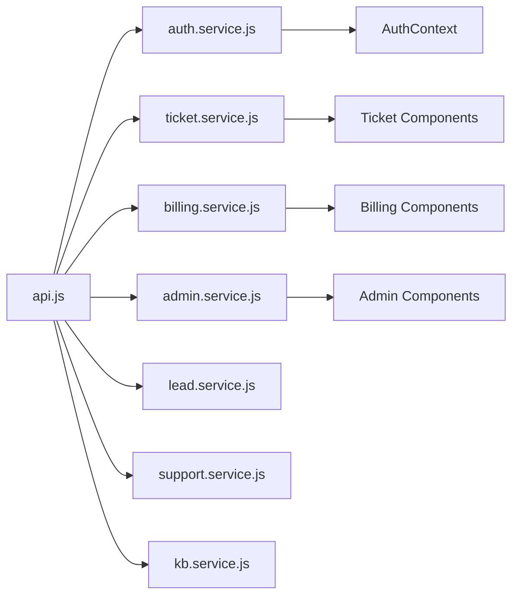

### Backend Service Dependencies
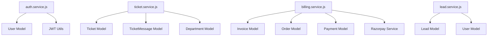

## State Management Flow

### Context Provider Dependencies
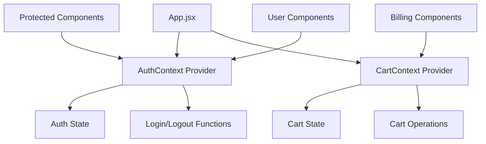

## API Endpoint Relationships

### RESTful API Structure
```mermaid
graph TB
    A[/api/auth] --> B[POST /login]
    A --> C[POST /register]
    A --> D[POST /logout]
    A --> E[GET /profile]
    
    F[/api/tickets] --> G[GET /]
    F --> H[POST /]
    F --> I[GET /:id]
    F --> J[PUT /:id]
    F --> K[POST /:id/messages]
    
    L[/api/billing] --> M[GET /invoices]
    L --> N[GET /orders]
    L --> O[POST /checkout]
    L --> P[GET /services]
    
    Q[/api/admin] --> R[GET /stats]
    Q --> S[GET /users]
    Q --> T[PUT /users/:id]
```

## Error Handling Dependencies

### Error Propagation Flow
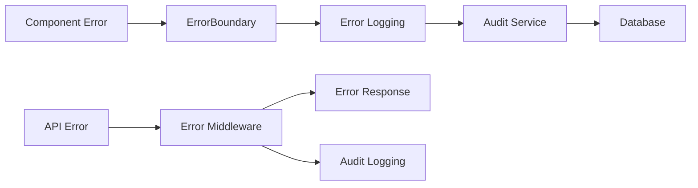

This dependency graph provides a comprehensive view of how components and modules interact throughout the WebGenix application, enabling efficient navigation and understanding of system relationships.